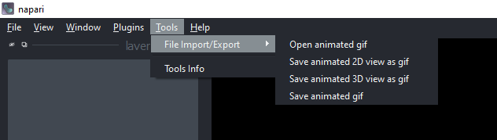

# napari-animated-gif-io

Open and save 3D image stacks as animated gifs

You find the menus for opening and saving animated gifs in the `Tools > File Import/Export` menu:

Furthermore, if in 3D view, you can save the current view with a little tilt animation as animated gif.
Under the hood this uses the [microfilm](https://github.com/guiwitz/microfilm) library.

If in 2D view, you can also make an animation by going throught the 2D slices of the currently visible dimension/axis. This is implemented in a similar way to the 3D view animations using [microfilm](https://github.com/guiwitz/microfilm), but due to some conflicts with converting 2D slices to microfilm's colorspace it has also been implemented using [Pillow](https://python-pillow.org/). It is recommended to select the "use Pillow to generate gif" option to avoid color issues in your animation.

----------------------------------

This [napari] plugin was generated with [Cookiecutter] using [@napari]'s [cookiecutter-napari-plugin] template.

## Installation

You can install `napari-animated-gif-io` via [pip]:

    pip install napari-animated-gif-io

To install latest development version :

    pip install git+https://github.com/haesleinhuepf/napari-animated-gif-io.git

## Contributing

Contributions are very welcome. Tests can be run with [tox], please ensure
the coverage at least stays the same before you submit a pull request.

## License

Distributed under the terms of the [BSD-3] license,
"napari-animated-gif-io" is free and open source software

## Issues

If you encounter any problems, please [file an issue] along with a detailed description.

[napari]: https://github.com/napari/napari
[Cookiecutter]: https://github.com/audreyr/cookiecutter
[@napari]: https://github.com/napari
[BSD-3]: http://opensource.org/licenses/BSD-3-Clause
[cookiecutter-napari-plugin]: https://github.com/napari/cookiecutter-napari-plugin

[file an issue]: https://github.com/haesleinhuepf/napari-animated-gif-io/issues

[tox]: https://tox.readthedocs.io/en/latest/
[pip]: https://pypi.org/project/pip/
